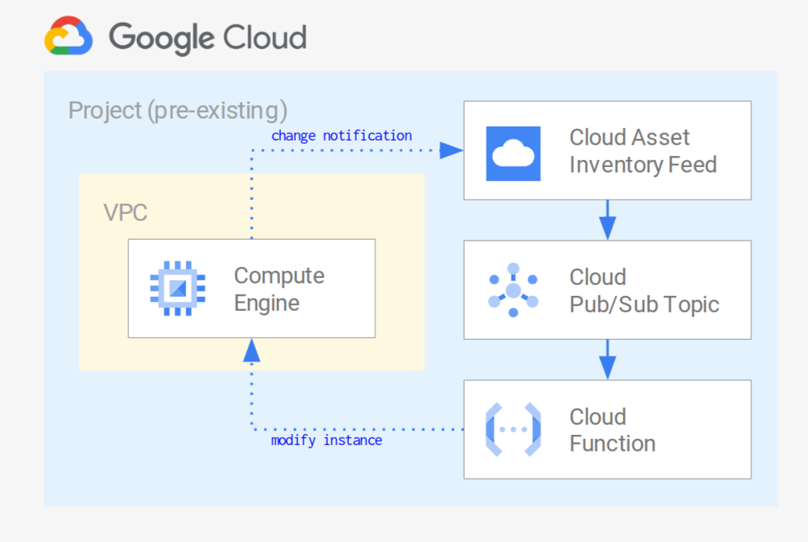

[](https://github.com/pre-commit/pre-commit)

# Cloud Asset Inventory feeds
This terraform module creates an opiniated infrastructure to generate Google Cloud Asset Inventory feed and it's associated trigger actions.

The bellow image take the example of a Compute Engine cloud asset which modification would in turn trigger control and possibly modification if previous modification does not abide by some compliance rules:  



## Prerequisities

**Ensure:**  
* You have an existing GCP project to host the infrastructure
* The effective identity running the terraform module can create and destroy ressource types required by this module
* In particular, the following permissions on project | folder | org, depending on the feeds scope:
  * https://cloud.google.com/asset-inventory/docs/access-control#required_permissions
  * https://cloud.google.com/resource-manager/docs/creating-managing-organization#retrieving_your_organization_id
  * https://cloud.google.com/resource-manager/docs/creating-managing-folders#viewing_or_listing_folders_and_projects
  * BigQuery editor on the feed infrastructure hosting project


## Basic Usage

```terraform
module "basic_feed" {
  source             = "github.com/lvmh-group-it/terraform-module-gcp-asset-feeds"
  hosting_project_id = "hld-int-sbxiho-prj-cloud-iho"
  feed_operators     = ["user:ismael.hommani.ext@lvmh.com", "user:renaud.buttiero.ext@lvmh.com"]

  feeds = {

    cf-crud = {
      description        = "Email alert on function CRUD operations"
      assets_parent_type = "PROJECTS"
      assets_parent_id   = "hld-int-sbxiho-prj-cloud-iho"
      asset_type         = "cloudfunctions.googleapis.com/Function"
      trigger_action = {
        type   = "ALERT"
        config = {}
      }
    }

  }
}
```

More example available in the [example folder](./examples).  

## Versions

This module uses [Semantic Versioning](https://semver.org/).

Multiple git tags are used to track versions:

* `vX.Y.Z` is an exact version, and is never updated
* `vX.Y` is a minor version, and is updated when fixes are added
* `vX` is a major version, and is updated when new features are added.

When a breaking change is introduced, the major version is incremented and using `?ref=vX` is safe.

Use the tag_repo.sh script to create and allign tag according the above rule.  

## Pre-commit

This template repository initiates with a `.pre-commit-config.yaml` which is a configuration file for the [pre-commit](https://pre-commit.com/) tool.  
It relies heavily on this dedicated [terraform hook repo](https://github.com/antonbabenko/pre-commit-terraform).  
To run it locally, you can either use the [standard way](https://github.com/antonbabenko/pre-commit-terraform#how-to-install) by installing hooks or [through Docker](https://github.com/antonbabenko/pre-commit-terraform#how-to-install).  

<!-- BEGINNING OF PRE-COMMIT-TERRAFORM DOCS HOOK -->
## Requirements

| Name | Version |
|------|---------|
| <a name="requirement_terraform"></a> [terraform](#requirement\_terraform) | >= 1.5.0 |
| <a name="requirement_google"></a> [google](#requirement\_google) | ~> 5.0.0 |

## Providers

| Name | Version |
|------|---------|
| <a name="provider_google"></a> [google](#provider\_google) | ~> 5.0.0 |

## Modules

No modules.

## Resources

| Name | Type |
|------|------|
| [google_bigquery_dataset.data_sink](https://registry.terraform.io/providers/hashicorp/google/latest/docs/resources/bigquery_dataset) | resource |
| [google_bigquery_table.data_sink_table](https://registry.terraform.io/providers/hashicorp/google/latest/docs/resources/bigquery_table) | resource |
| [google_cloud_asset_folder_feed.folder_feeds](https://registry.terraform.io/providers/hashicorp/google/latest/docs/resources/cloud_asset_folder_feed) | resource |
| [google_cloud_asset_organization_feed.organisation_feeds](https://registry.terraform.io/providers/hashicorp/google/latest/docs/resources/cloud_asset_organization_feed) | resource |
| [google_cloud_asset_project_feed.project_feeds](https://registry.terraform.io/providers/hashicorp/google/latest/docs/resources/cloud_asset_project_feed) | resource |
| [google_monitoring_alert_policy.alert_policy](https://registry.terraform.io/providers/hashicorp/google/latest/docs/resources/monitoring_alert_policy) | resource |
| [google_monitoring_notification_channel.mails](https://registry.terraform.io/providers/hashicorp/google/latest/docs/resources/monitoring_notification_channel) | resource |
| [google_project_iam_binding.feed_operators](https://registry.terraform.io/providers/hashicorp/google/latest/docs/resources/project_iam_binding) | resource |
| [google_project_iam_custom_role.feeds_operator_role](https://registry.terraform.io/providers/hashicorp/google/latest/docs/resources/project_iam_custom_role) | resource |
| [google_project_iam_member.data_sink_editor](https://registry.terraform.io/providers/hashicorp/google/latest/docs/resources/project_iam_member) | resource |
| [google_project_service.project_services](https://registry.terraform.io/providers/hashicorp/google/latest/docs/resources/project_service) | resource |
| [google_pubsub_subscription.feed_events_writer](https://registry.terraform.io/providers/hashicorp/google/latest/docs/resources/pubsub_subscription) | resource |
| [google_pubsub_topic.dead_letter](https://registry.terraform.io/providers/hashicorp/google/latest/docs/resources/pubsub_topic) | resource |
| [google_pubsub_topic.feeds](https://registry.terraform.io/providers/hashicorp/google/latest/docs/resources/pubsub_topic) | resource |
| [google_project.project](https://registry.terraform.io/providers/hashicorp/google/latest/docs/data-sources/project) | data source |

## Inputs

| Name | Description | Type | Default | Required |
|------|-------------|------|---------|:--------:|
| <a name="input_feed_operators"></a> [feed\_operators](#input\_feed\_operators) | Group or identity emails to give access to feed related logs and alerting. Must follow format https://cloud.google.com/billing/docs/reference/rest/v1/Policy#Binding | `list(string)` | `[]` | no |
| <a name="input_feeds"></a> [feeds](#input\_feeds) | GCP targets in the sens of ORGANISATIONS, FOLDERS or PROJECTS. Each target creates a new BQ dataset in the hosting\_project\_id which is feed with a specified recurency. | <pre>map(object({<br>    description        = string<br>    assets_parent_type = string<br>    assets_parent_id   = string<br><br>    # (optional) realtime or scheduled. If scheduled set a cron. realtime use feeds. schedule use cron job & a function which use the search all API<br>    # control_type       = string<br>    # filter             = string  # not really needed. Condition on the temporalAsset. if we realise we don't want to know about deletion for instance<br><br>    # valid types available here: https://cloud.google.com/asset-inventory/docs/supported-asset-types<br>    asset_type = string # we can do a regexp on it<br>    trigger_action = object({<br>      type   = string<br>      config = object({})<br>    })<br>  }))</pre> | n/a | yes |
| <a name="input_hosting_project_id"></a> [hosting\_project\_id](#input\_hosting\_project\_id) | GCP project id where to host the different 'extrations' specified in extraction\_targets | `string` | n/a | yes |
| <a name="input_labels"></a> [labels](#input\_labels) | value | `map(string)` | `{}` | no |
| <a name="input_region"></a> [region](#input\_region) | Region location of resources to create | `string` | `"europe-west1"` | no |

## Outputs

| Name | Description |
|------|-------------|
| <a name="output_bq_data_sink_dataset"></a> [bq\_data\_sink\_dataset](#output\_bq\_data\_sink\_dataset) | Location of the Bigquery Dataset containing table where selected feed events are exported vanilla |
| <a name="output_bq_data_sink_table"></a> [bq\_data\_sink\_table](#output\_bq\_data\_sink\_table) | Location of the Bigquery table where selected feed events are exported vanilla |
| <a name="output_examples_get_feed_cli"></a> [examples\_get\_feed\_cli](#output\_examples\_get\_feed\_cli) | Gcloud command line example to get feed info. Feed are not accessible from the cloud console. |
| <a name="output_folder_feeds"></a> [folder\_feeds](#output\_folder\_feeds) | Organisation folder level feed |
| <a name="output_monitoring_feed_alert"></a> [monitoring\_feed\_alert](#output\_monitoring\_feed\_alert) | Feed failures alert policy |
| <a name="output_organisation_feeds"></a> [organisation\_feeds](#output\_organisation\_feeds) | Organisation level feed |
| <a name="output_project_feeds"></a> [project\_feeds](#output\_project\_feeds) | Project level feed |
<!-- END OF PRE-COMMIT-TERRAFORM DOCS HOOK -->
